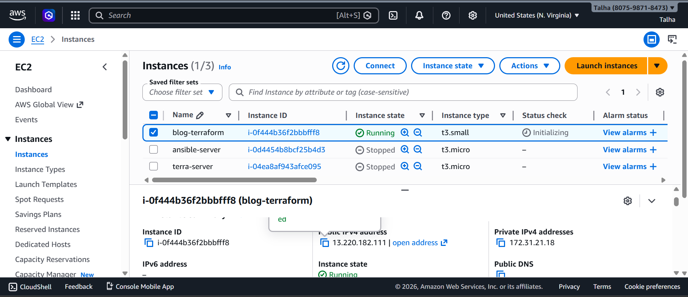
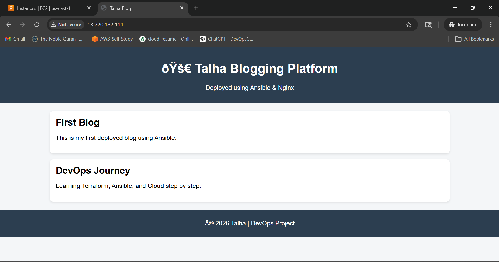

# 🚀 Automated Web Infrastructure Deployment using Terraform (AutoDeployX)

## 📌 Project Overview
This project demonstrates automated deployment of a web application on AWS using Terraform. The infrastructure is provisioned using Infrastructure as Code (IaC), and the application is deployed automatically using a shell script during EC2 instance initialization.

---

## 🧱 Architecture
User → EC2 Instance → Nginx → Blog Website

---

## ⚙️ Tech Stack
- AWS EC2  
- Terraform (Infrastructure as Code)  
- Nginx (Web Server)  
- GitHub (Source Code Hosting)  

---

## 🚀 Features
- Automated EC2 provisioning using Terraform  
- Automated Nginx installation using user_data script  
- Deployment of blog website from GitHub repository  
- Security Group configuration for SSH (22) and HTTP (80) access  
- Fully automated end-to-end setup  

---

## 📂 Project Structure
```
blog-terraform/
 ├── terraform.tf
 ├── test_ec2.tf
 ├── provider.tf
 ├── variables.tf
 ├── outputs.tf
 ├── install_blog.sh
 ├── README.md
 └── screenshots/

---

## ▶️ How to Run

### 1️⃣ Initialize Terraform
```bash
terraform init
```

### 2️⃣ Apply Configuration
```bash
terraform apply
```

Type `yes` when prompted.

---

### 3️⃣ Get Public IP
```bash
terraform output public_ip
```

---

### 4️⃣ Access Website
Open in browser:
```
http://13.220.182.111/
```

---

## 📸 Screenshots

### EC2 Instance Running


### Website Live


---

## 🧠 Key Learnings
- Infrastructure as Code using Terraform  
- Automating server setup using user_data scripts  
- Integrating GitHub with cloud deployment  
- Basic cloud security using Security Groups  
  

---

## 💼 Use Case
This project simulates how DevOps engineers automate infrastructure provisioning and application deployment in cloud environments, reducing manual effort and improving consistency.

---

## 🔥 Future Improvements
- Implement custom VPC with public and private subnets  
- Add Elastic IP for consistent public access  
- Integrate with Ansible for configuration management  
- Add Application Load Balancer (ALB) for scalability  
- Implement CI/CD pipeline (GitHub Actions)  

---

## 👨‍💻 Author
Talha Khan  
Aspiring DevOps / Cloud Engineer 🚀
